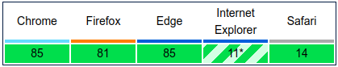

> JPEG-image decoding, encoding & EXIF reading library for a browser and node.js



## Installation

installing with npm:

```bash
npm install inkjet --save
```

## In browser

To use *inkjet* in a browser, use `inkjet.js` or `inkjet.min.js` in `/dist` directory, or build it manually:

```bash
npm install
npm run browser
```

## Usage
Decoding, encoding and EXIF extraction operations are offloaded to [WebWorkers](https://developer.mozilla.org/en-US/docs/Web/API/Web_Workers_API/Using_web_workers) if the environment supports them.

### Decode JPEG

```javascript
var inkjet = require('inkjet');

var filepath = './images/js_logo-4-2-0.jpg';
var buf = fs.readFileSync(filepath);

inkjet.decode(buf, function(err, decoded) {
  // decoded: { width: number, height: number, data: Uint8Array }
});
```

### Encode JPEG

```javascript
var inkjet = require('inkjet');

var width = 320;
var height = 180;
var frameData = new Buffer(width * height * 4);
var i = 0;

while (i < frameData.length) {
  frameData[i++] = 0xFF; // R, red
  frameData[i++] = 0x00; // G, green
  frameData[i++] = 0x00; // B, blue
  frameData[i++] = 0xFF; // A, alpha - ignored in JPEGs
}

var buf = frameData;
var options = {
  width: width,
  height: height,
  quality: 80
};

inkjet.encode(buf, options, function(err, encoded) {
  // encoded: { width: number, height: number, data: Uint8Array }
});
```

### Read EXIF

```javascript
var inkjet = require('inkjet');

var filepath = './images/js_logo-exif.jpg';
var buf = fs.readFileSync(filepath);
inkjet.exif(buf, function(err, metadata) {
  // metadata -- an object that maps EXIF tags to string values
});
```

### Deduce image type

```javascript
var inkjet = require('inkjet');

var filepath = './images/js_logo-4-2-0.jpg';
var buf = fs.readFileSync(filepath);
inkjet.magic(buf, function(err, data) {
  // data -- an object that contains mime-type and extension
});
```

### Image information

```javascript
var inkjet = require('inkjet');

var filepath = './images/js_logo-4-2-0.jpg';
var buf = fs.readFileSync(filepath);
inkjet.info(buf, function(err, data) {
  // data -- an object that contains width, height, mime type and extension data
});
```

## API

### .decode(buf, [options], cb);

Decodes a JPEG image.

Arguments:
* `buf` - source buffer, one of the following types: `Buffer|ArrayBuffer|Uint8Array|Uint8ClampedArray`
* `[options]` - an optional object with settings to decode an image. Supported options:
  * `width` - override image width
  * `height` - override image height
* `cb` - a callback that gets 2 arguments:
  * `err` - decoding `Error`
  * `decoded` - an object that describes the decoded image: `{ width: number, height: number, data: Uint8Array }`
                where data represents colors in RGBA format.

```javsscript
inkjet.decode(buf, function(err, decoded) {
  // ...
});
```

### .encode(buf, [options], cb);

Encodes the provided buffer to a JPEG format.

Arguments:
* `buf` - source buffer, one of the following types: `Buffer|ArrayBuffer|Uint8Array|Uint8ClampedArray`
* `[options]` - an optional object with settings to encode an image. Supported options:
  * `width` - width of the image in `buf`
  * `height`- height of the image in `buf`
  * `quality` - a numberic value [0-100], describes quality of encoding. 0 - low quality, 100 - high quality.
* `cb` - a callback that gets 2 arguments:
  * `err` - encoding `Error`
  * `encoded` - an object that describes the encoded image: `{ width: number, height: number, data: Uint8Array }`

```javascript
inkjet.encode(buf, function(err, encoded) {
  // ...
});
```

### .exif(buf, [options], cb);

Get EXIF metadata for the image. The metadata tags defined in the Exif standard cover date and time information, camera settings, descriptions, resolution and  location information.

Arguments:
* `buf` - source buffer, one of the following types: `Buffer|ArrayBuffer|Uint8Array|Uint8ClampedArray`
* `[options]` - an optional object with settings to encode an image. Supported options:
  * `hasMakerNote` - exclude *MakerNote* tag from metadata. Default value: `true`, *MakerNote* tag is excluded.
* `cb` - a callback that gets 2 arguments:
  * `err` - exif extraction `Error`
  * `metadata` - metadata object, a set of tags and their values.

```javascript
inkjet.exif(buf, function(err, metadata) {
  // ...
});
```

### .magic(buf, cb);

Deduce image type (mime type and extension) for the provided buffer.

Arguments:
* `buf` - source buffer, one of the following types: `Buffer|ArrayBuffer|Uint8Array|Uint8ClampedArray`
* `cb` - a callback that gets 2 arguments:
  * `err` - `Error` object
  * `data` - data object { "mimeType": string, "extension": string }

```javascript
inkjet.magic(buf, function(err, data) {
  // ...
});
```

### .info(buf, cb);

Get image information without reading and decoding an image.

Arguments:
* `buf` - source buffer, one of the following types: `Buffer|ArrayBuffer|Uint8Array|Uint8ClampedArray`
* `cb` - a callback that gets 2 arguments:
  * `err` - `Error` object
  * `data` - data object { "type": string, "mimeType": string, "extension": string, "width": number, "height: number" }

```javascript
inkjet.info(buf, function(err, data) {
  // data: {
  //   type: "image"
  //   mimeType: ...
});
```

## Tests

To run the tests for *inkjet* in Node.js:

```bash
npm test
```

To run tests in a browser:

```bash
npm run bundle:test
```

a bundle file `inkjet-test-bundle.js` with all tests will be generated in `inkjet/test/browser` directory.

Open `inkjet/test/browser/index.html` in the target browser. Tests will run automatically.

## Contact

[Grigorii Chudnov] (mailto:g.chudnov@gmail.com)


## License

Distributed under the [The MIT License (MIT)](LICENSE).
